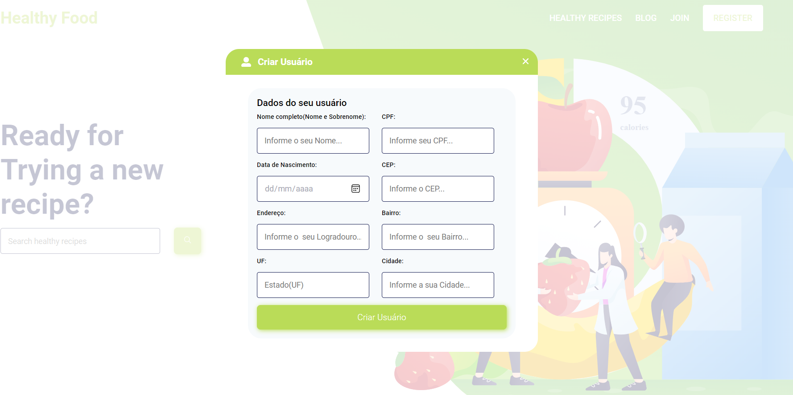

<h1 align="center"> 🚀🚀 Healthy Food 🚀🚀</h1>
<h2 align="center">Teste Frontend da GCBinvestimentos</h2>
<br>

## 💻 Projeto Desenvolvendo um site com opção de cadastro, e consumindo API dos Correios para preenchimento automático do formulário via CEP.
<br>
<p align="center">
  
</p>

## 🧪 Tecnologias

Esse projeto foi feito com as seguintes tecnologias:

- [ReactJS](https://reactjs.org)
- [TypeScript](https://www.typescriptlang.org/)
- [Styled-Components](https://styled-components.com/)
- [Axios](https://www.npmjs.com/package/axios)

---

```bash 

# Clone o repositório
$ git clone https://github.com/arthurfortunato/Healthy-Food.git
# Acesse a pasta do projeto no prompt de comando
$ cd Healthy-Food

# Instale as dependências
$ yarn

# Execute o script "start"
$ yarn start

# O projeto inciará na porta: 3000 